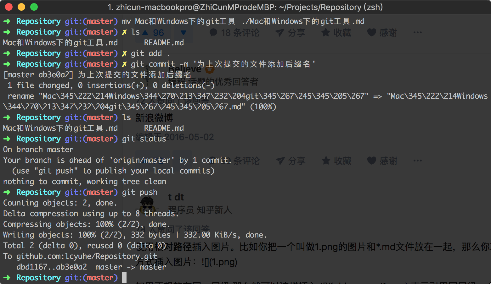

# 在Mac上使用Git
工具：iTerm2，装zsh

--
# 在Windows上使用Git
工具：gitforwindows

配置自动补全：https://git-scm.com/book/zh/v1/Git-%E5%9F%BA%E7%A1%80-%E6%8A%80%E5%B7%A7%E5%92%8C%E7%AA%8D%E9%97%A8

--
# 书
Progit v2: https://git-scm.com/book/zh/v2
