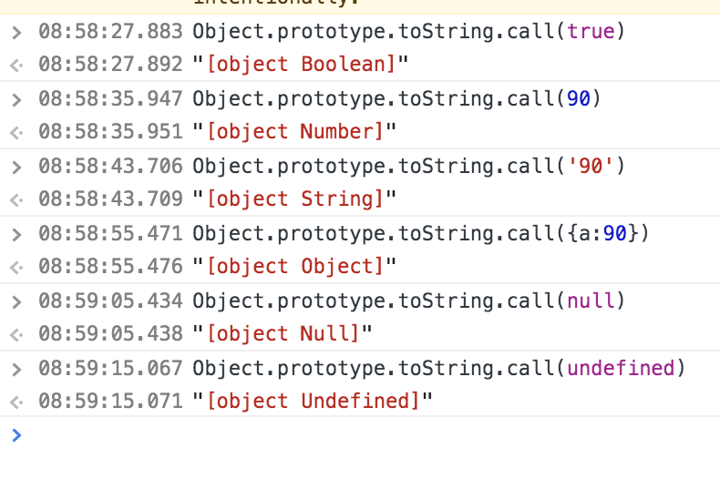
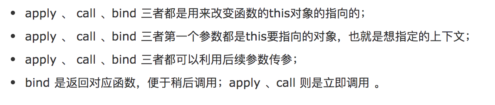

# Studynotes

知识库；日常学习的总结和好的文章收录；

---

## 行业标准

- W3C: [维基](https://zh.wikipedia.org/wiki/%E4%B8%87%E7%BB%B4%E7%BD%91%E8%81%94%E7%9B%9F) | [官网](https://www.w3.org/standards/)
- ECMAScript: [维基](https://zh.wikipedia.org/wiki/ECMAScript) | [github](https://github.com/tc39/ecma262) | [ES2020](https://tc39.es/ecma262/) | [阮一峰 《ECMAScript 6 入门》](https://es6.ruanyifeng.com/)
- WebRTC: [维基](https://zh.wikipedia.org/wiki/WebRTC) | [官网](https://webrtc.org/) | [MDN](https://developer.mozilla.org/zh-CN/docs/Web/API/WebRTC_API) | [Getting Started](https://webrtc.org/start/) | [Getting Started With WebRC](https://www.html5rocks.com/en/tutorials/webrtc/basics/)

---

- [Html 视频播放](https://github.com/lcyuhe/StudyNotes/tree/master/Html%E8%A7%86%E9%A2%91%E6%92%AD%E6%94%BE)
- [Mac 和 Windows 下的 git 工具](https://github.com/lcyuhe/StudyNotes/tree/master/Mac%E5%92%8CWindows%E4%B8%8B%E7%9A%84git%E5%B7%A5%E5%85%B7)
- [JSX 实现换行](https://blog.csdn.net/Zckguiying/article/details/88641357)（\n + white-space:pre-line;）
- [控制 input 光标的位置](https://segmentfault.com/a/1190000016758141)（input.selectionStart 属性）
- [启动一个 web 服务](https://blog.csdn.net/weixin_39786582/article/details/83857059)（npx http-server）
- [对资源添加版本号解决浏览器缓存问题](https://www.jianshu.com/p/2e554161b930)（使用 gulp）
- [electron web 页面间交互](https://github.com/hokein/electron-screen-recorder/blob/master/src/main.js)
- electron 窗口间传递 MediaStream 对象（IPC only supports serialised messages and does not preserve MediaStreams or ObjectUrls）：[Pass Mediastream from One Window to Another](https://discuss.atom.io/t/pass-mediastream-from-one-window-to-another/29963)、[electron-peer-connection](https://github.com/han-gyeol/electron-peer-connection)
- [判断是数组](https://segmentfault.com/a/1190000006150186)（1、Array.isArray(var) 2、Object.prototype.toString.call(var)|Object.prototype.toString.apply(var) = ('[object Object]'、'[object Array]'、''、'[object Boolean]'、'[object String]'、'[object Number]')）
  <br/>
  
- [node 压缩工具 compressing](https://github.com/node-modules/compressing)
- [fetch 上传文件](https://zhuanlan.zhihu.com/p/34291688)
- [React 将字符串中的 URL 转换为适当的 a 元素](https://juejin.im/post/5ce411f66fb9a07edc0b2b1f)
- [apply、call、bind](https://www.cnblogs.com/coco1s/p/4833199.html)
  <br/>
  
- electron 窗口间传递 MediaStream 对象（IPC only supports serialised messages and does not preserve MediaStreams or ObjectUrls）：[Pass Mediastream from One Window to Another](https://discuss.atom.io/t/pass-mediastream-from-one-window-to-another/29963)、[electron-peer-connection](https://github.com/han-gyeol/electron-peer-connection)
- [electron-builder将资源保存获取绝对路径](https://stackoverflow.com/questions/41823184/how-to-get-icon-path-image-in-electron-builder) => 第二个回答
   <br/>
  1.Make sure you have this in your package.json:
  ```
    "build": {
      ...
      "extraResources": [
        "./assets/**"
      ],
    }
    ```
  2.Then in your code you can have:
  ```
  const assetsPath = app.isPackaged ? path.join(process.resourcesPath, "./assets") : path.join("./assets");
  ```
